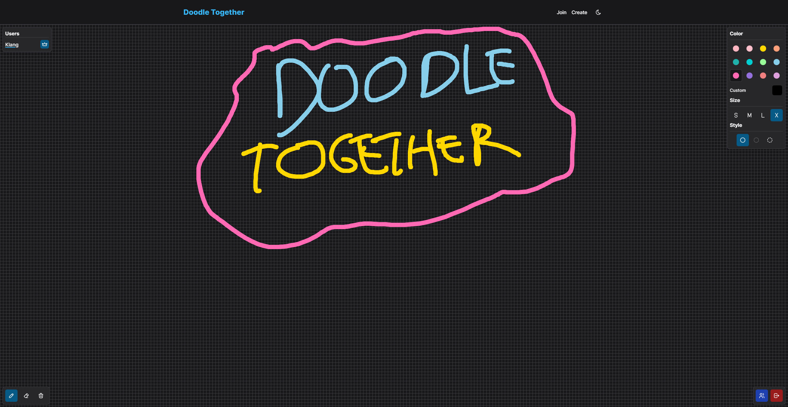

# 🎨 Doodle Together - Draw with friends



Doodle Together is a collaborative drawing web application that allows multiple users to create artwork together on a shared canvas in real-time. It's perfect for having fun, brainstorming ideas, or simply unleashing your creativity with friends and colleagues.

## ✨ Features

- **Real-time Collaboration**: Draw, sketch, and paint together with your friends or teammates in real-time, no matter where they are.
- **User-friendly Interface**: The intuitive and user-friendly interface makes it easy for anyone to join a canvas and start drawing.
- **Interactive Tools**: Choose from a variety of drawing tools, colors, and brush sizes to bring your ideas to life.
- **Room Management**: Room owner can choose to view or kick room users with just a few clicks.

## 👀 Live Preview

Check out the live preview of Doodle Together: [Live Demo](https://doodletogether.vercel.app)

## 🚀 Technologies Used

- Frontned: NextJS, Valtio, TailwindCSS, Zod, SocketIO, RadixUI
- Backend: NestJS, Redis, SocketIO, WebSockets

## 🛠️ Requirements

Before you begin, ensure you have met the following requirements:

- ✅ [Node.js](https://nodejs.org/) installed
- ✅ [npm](https://www.npmjs.com/) or [yarn](https://yarnpkg.com/) package manager installed
- ✅ A [Redis](https://redis.io/) database is needed in order the project to work.

## 📦 Installation

To install Doodle Together you need to follow the next steps:

1. Clone this repository to your local machine.

2. Install the required dependencies using `npm` or `yarn`:

```bash
npm install
# or
yarn install
```

3. Create the env files in both web and backend apps:

- Copy the `.env.example` file in the `apps/web` directory to `.env` and then modify :

```bash
cp .env.example .env
```

- Copy the `.env.example` file in the `apps/backend` directory to `.env` and then modify :

```bash
cp .env.example .env
```

1. Fill out the recently created env files with proper data as your requirements:

apps/web/.env

```bash
# App
NEXT_PUBLIC_URL="http://localhost:3000"
NEXT_PUBLIC_BACKEND_ENDPOINT="http://localhost:4000"
```

apps/backend/.env

```bash
# Redis
REDIS_HOST="redishost"
REDIS_PORT=35005
REDIS_PASSWORD="redispassword"

# Room
ROOM_EXPIRES=7200

# Auth
JWT_SECRET="supersecret"

# App
APP_PORT=4000
FRONTEND_ENDPOINT="http://localhost:3000"
```

5. Start the development server by using the following command:

```bash
npm run dev
#or
yarn run dev
```

6. Open your web browser and navigate to `http://localhost:3000` to start doodling!

## 🤝 Contributing

Contributions are welcome! If you find any bugs or have suggestions for new features, please feel free to open an issue or submit a pull request.

## 📄 License

This project is licensed under the [MIT License](./LICENSE.md).
